# 전남테크노파크 PMS 사용자 순서도 (매뉴얼 참고용)

> 이 문서는 사용자 매뉴얼 작성 시 참고하는 순서도 모음입니다.  
> 각 순서도 아래 `[스크린샷 위치]` 표시된 곳에 실제 화면 캡처를 삽입하세요.

---

## 목차

1. [시스템 전체 구성도](#1-시스템-전체-구성도)
2. [회원가입 순서도](#2-회원가입-순서도)
3. [로그인 순서도](#3-로그인-순서도)
4. [기업 과제신청 순서도 (전체 흐름)](#4-기업-과제신청-순서도-전체-흐름)
5. [과제신청 Step별 상세 순서도](#5-과제신청-step별-상세-순서도)
6. [관리자 사업/공고 등록 순서도](#6-관리자-사업공고-등록-순서도)
7. [관리자 과제 심사 순서도](#7-관리자-과제-심사-순서도)
8. [과제신청 상태 전환 흐름도](#8-과제신청-상태-전환-흐름도)
9. [화면별 주요 버튼 안내](#9-화면별-주요-버튼-안내)

---

## 1. 시스템 전체 구성도

```
┌─────────────────────────────────────────────────────────────────┐
│                  전남테크노파크 PMS 시스템                         │
├─────────────────┬───────────────────┬───────────────────────────┤
│   공개 포털      │   기업 마이페이지   │      관리자 백오피스         │
│  (/_m/ko)       │   (/_m/myp)        │      (/_msys)              │
├─────────────────┼───────────────────┼───────────────────────────┤
│ • 메인 페이지    │ • 대시보드         │ • 대시보드                  │
│ • 사업공고 조회  │ • 과제신청 (6단계) │ • 사업/공고 관리            │
│ • 공지사항       │ • 기업정보 관리    │ • 과제신청 심사             │
│ • FAQ           │ • 사용자 정보 관리 │ • 평가 관리                 │
│ • 자료실         │ • 설문조사 참여    │ • 게시판 관리               │
│ • 사업일정       │ • 타기관 공고 조회 │ • 메시지 발송               │
│ • 회원가입/로그인│                   │ • 통계/로그                 │
└─────────────────┴───────────────────┴───────────────────────────┘
```

**접속 방법:**
- 공개 포털: 웹브라우저에서 시스템 URL 접속
- 마이페이지: 로그인 후 자동 이동
- 관리자: 별도 관리자 URL 접속 (운영자에게 문의)

---

## 2. 회원가입 순서도

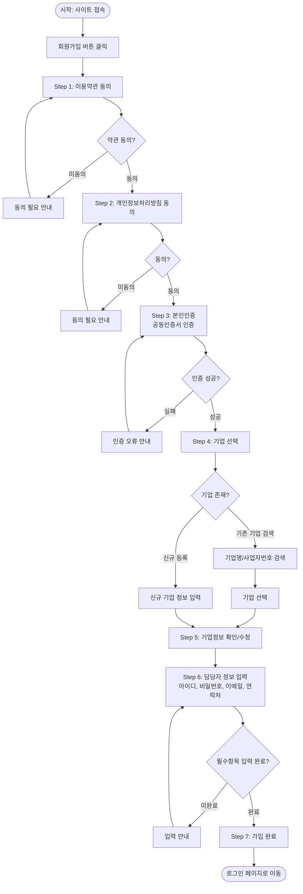

**[스크린샷 위치]**
- `회원가입_Step1_약관동의.png`
- `회원가입_Step3_본인인증.png`
- `회원가입_Step4_기업선택.png`
- `회원가입_Step6_담당자정보.png`
- `회원가입_Step7_완료.png`

---

## 3. 로그인 순서도

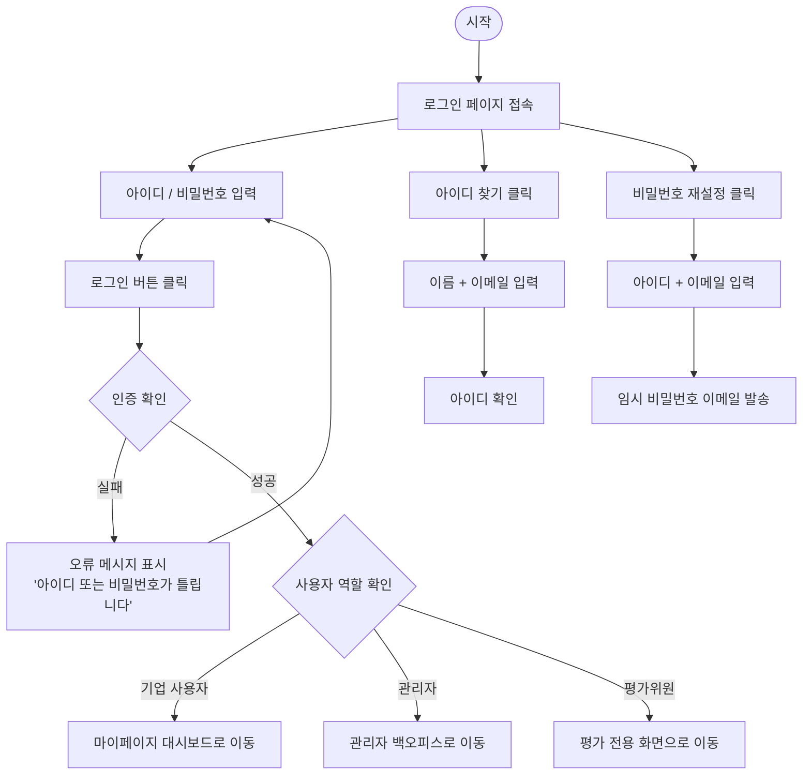

**[스크린샷 위치]**
- `로그인_화면.png`
- `로그인_성공_마이페이지.png`

---

## 4. 기업 과제신청 순서도 (전체 흐름)

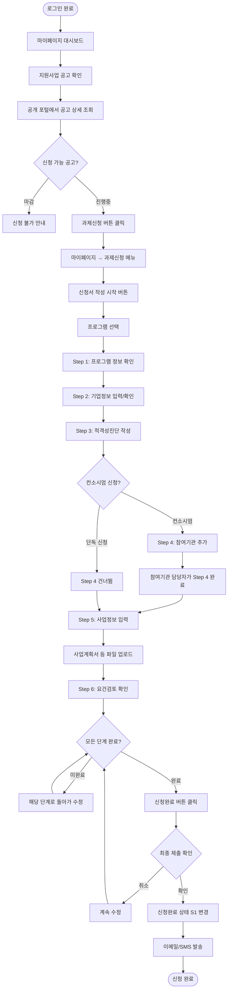

**[스크린샷 위치]**
- `과제신청_목록화면.png`
- `과제신청_신청완료_버튼.png`

---

## 5. 과제신청 Step별 상세 순서도

### Step 1 - 프로그램 정보 확인

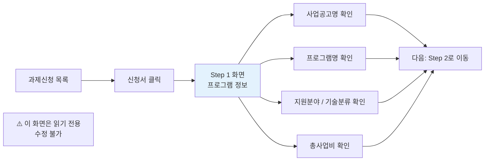

**[스크린샷 위치]**
- `Step1_프로그램정보.png`

---

### Step 2 - 기업정보 입력

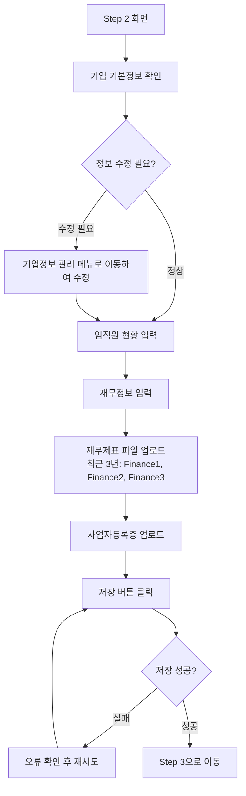

**[스크린샷 위치]**
- `Step2_기업정보_입력화면.png`
- `Step2_파일업로드.png`

---

### Step 3 - 적격성진단

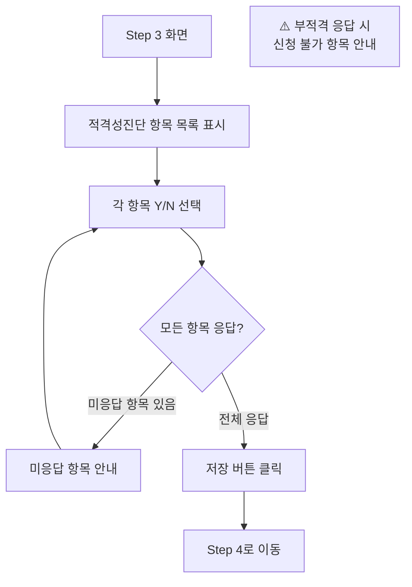

**[스크린샷 위치]**
- `Step3_적격성진단.png`

---

### Step 4 - 컨소시엄/참여기관

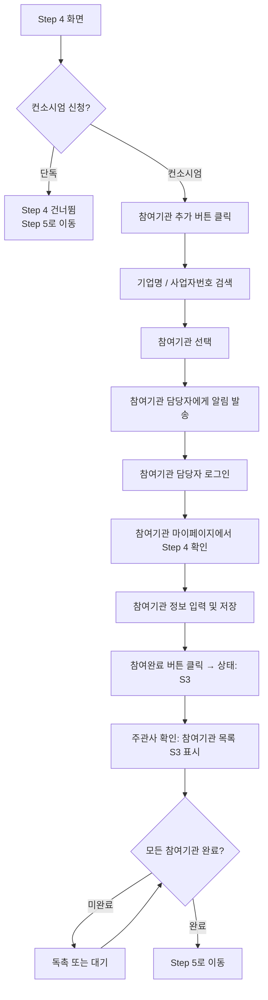

**[스크린샷 위치]**
- `Step4_참여기관_목록.png`
- `Step4_참여기관_추가팝업.png`
- `Step4_참여기관_상태확인.png`

---

### Step 5 - 사업정보 입력

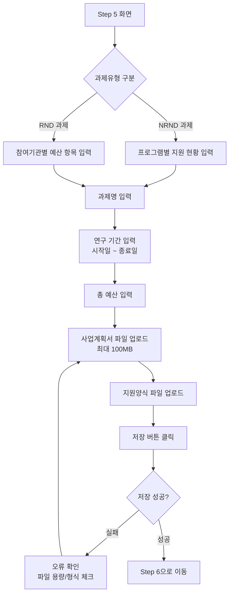

**[스크린샷 위치]**
- `Step5_사업정보_NRND.png`
- `Step5_사업정보_RND.png`
- `Step5_사업계획서_업로드.png`

---

### Step 6 - 요건검토 / 보완요청 대응

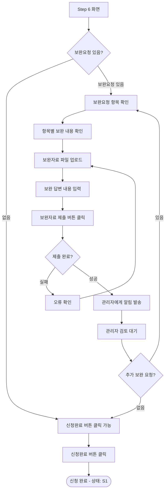

**[스크린샷 위치]**
- `Step6_요건검토_보완없음.png`
- `Step6_보완요청_목록.png`
- `Step6_보완자료_업로드.png`

---

## 6. 관리자 사업/공고 등록 순서도

### 사업 등록

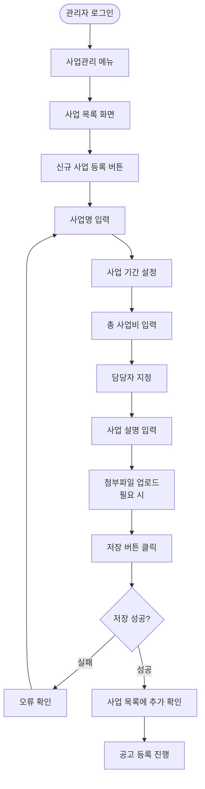

**[스크린샷 위치]**
- `관리자_사업목록.png`
- `관리자_사업등록_폼.png`

---

### 공고 등록

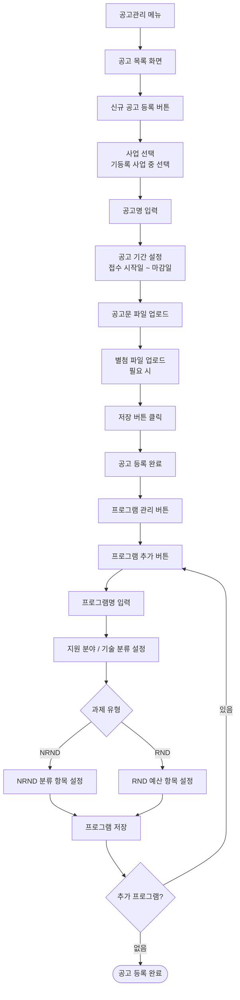

**[스크린샷 위치]**
- `관리자_공고등록_폼.png`
- `관리자_프로그램관리.png`

---

## 7. 관리자 과제 심사 순서도

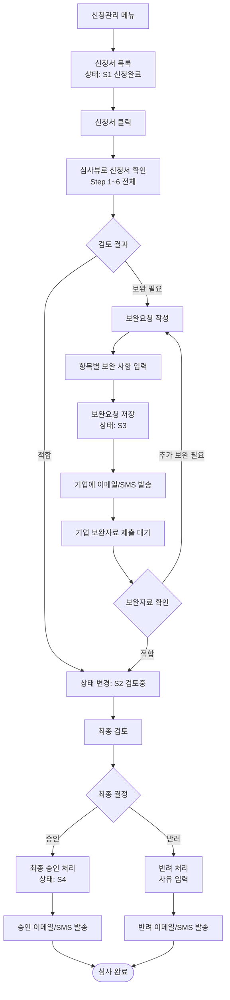

**[스크린샷 위치]**
- `관리자_신청서목록.png`
- `관리자_신청서_심사뷰.png`
- `관리자_보완요청_작성.png`
- `관리자_최종승인_처리.png`

---

## 8. 과제신청 상태 전환 흐름도

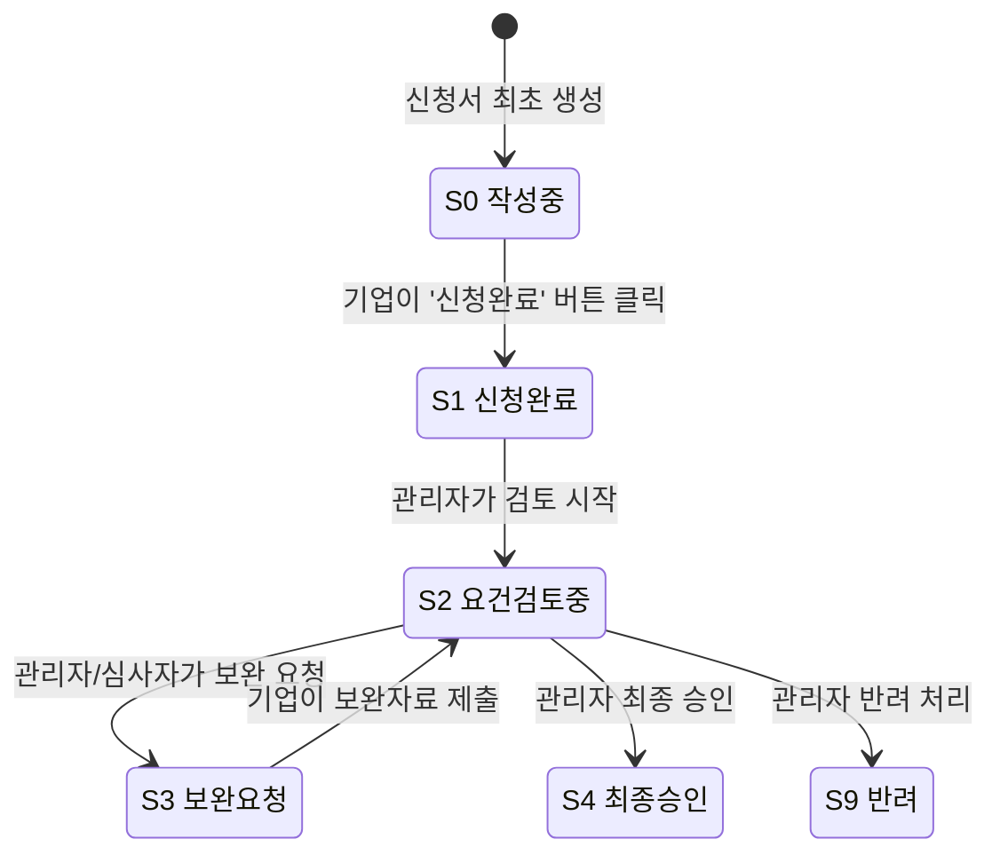

**참여기관 상태 전환:**

```
[참여신청: S1] → [참여완료: S3] → [승인완료: S4]
     ↑                              ↓
  참여기관이              주관사/심사자가
  초대받음                  최종 확인
```

---

## 9. 화면별 주요 버튼 안내

### 기업 마이페이지 주요 버튼

| 화면 | 버튼명 | 기능 | 주의사항 |
|------|--------|------|---------|
| 과제신청 목록 | `신청서 작성` | 새 신청서 작성 시작 | 공고 마감 전에만 사용 가능 |
| Step 2~5 | `저장` | 현재 단계 임시 저장 | 언제든 저장 가능 |
| Step 5 | `파일 업로드` | 서류 첨부 | 100MB 이하, 허용 형식만 |
| Step 4 | `참여기관 추가` | 컨소시엄 기관 초대 | 기업 사업자번호로 검색 |
| Step 4 | `참여완료` | 참여기관이 단계 완료 | 참여기관 담당자만 클릭 가능 |
| Step 6 | `신청완료` | 최종 제출 | **취소 불가 — 신중하게!** |
| Step 6 | `보완자료 제출` | 보완 답변 제출 | 보완요청 항목 모두 작성 후 |

### 관리자 백오피스 주요 버튼

| 화면 | 버튼명 | 기능 | 주의사항 |
|------|--------|------|---------|
| 사업 목록 | `신규 사업 등록` | 사업 생성 | 사업 기간 정확하게 입력 |
| 공고 목록 | `신규 공고 등록` | 공고 생성 | 사업 먼저 등록 필요 |
| 공고 상세 | `프로그램 관리` | 프로그램 추가/편집 | 공고 저장 후 가능 |
| 신청서 목록 | `심사뷰` | 신청서 상세 확인 | 읽기 전용 |
| 심사뷰 | `보완요청` | 보완 사항 입력 | 기업에 자동 알림 발송 |
| 심사뷰 | `최종 승인` | 신청 승인 처리 | **되돌리기 어려움 — 신중하게!** |

---

## 스크린샷 촬영 가이드

매뉴얼 작성 시 아래 순서로 화면을 캡처하세요:

### 필수 캡처 목록

**공개 포털:**
- [ ] 메인 페이지 전체 화면
- [ ] 사업공고 목록 화면
- [ ] 사업공고 상세 화면
- [ ] 로그인 화면
- [ ] 회원가입 Step 1~7 각 화면

**기업 마이페이지:**
- [ ] 대시보드 (로그인 직후)
- [ ] 과제신청 목록 화면
- [ ] Step 1~6 각 화면
- [ ] 파일 업로드 팝업
- [ ] 참여기관 추가 팝업
- [ ] 신청완료 확인 팝업

**관리자 백오피스:**
- [ ] 관리자 대시보드
- [ ] 사업 목록 / 등록 화면
- [ ] 공고 목록 / 등록 화면
- [ ] 프로그램 관리 화면
- [ ] 신청서 목록 (심사 화면)
- [ ] 보완요청 작성 화면

### 캡처 권장 해상도
- 전체 화면: 1920×1080
- 팝업/모달: 해당 영역 클로즈업
- 버튼 강조: 빨간 테두리 또는 화살표 표시
